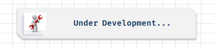

  

<h1 align="center">
:small_red_triangle_down: Recreating the Netflix Interface
</h1>

  

<h2 align="center">
Bootcamp everis Fullstack Developer by Digital Innovation One
</h2>

  

  

This repository was created as part of bootcamp "everis FullStack Developer" by Digital Innovation One and it's purpose is recreate the Netflix interface to reinforce the principles of HTM5, CSS3 and responsive websites.

  <a href="#cloud-deploy">Deploy</a>&nbsp;&nbsp;&nbsp;|&nbsp;&nbsp;&nbsp;
  <a href="#rocket-technologies">Technologies</a>&nbsp;&nbsp;&nbsp;|&nbsp;&nbsp;&nbsp;
  <a href="#computer-installation">Instalation</a>&nbsp;&nbsp;&nbsp;|&nbsp;&nbsp;&nbsp;
  <a href="#books-learning">Learning</a>&nbsp;&nbsp;&nbsp;|&nbsp;&nbsp;&nbsp;
  <a href="#small_orange_diamond-sharing">Sharing</a>&nbsp;&nbsp;&nbsp;|&nbsp;&nbsp;&nbsp;
  <a href="#small_orange_diamond-customizing">Customizing</a>&nbsp;&nbsp;&nbsp;|&nbsp;&nbsp;&nbsp;
  <a href="#small_orange_diamond-license">License</a>

  

## :cloud: Deploy

## :rocket: Technologies

## :computer: Installation

## :books: Learning

## :small_orange_diamond: Sharing

## :small_orange_diamond: Customizing

## :small_orange_diamond: License

This project is undet MIT license. Open file [LICENSE](LICENSE.md) to details. 
The images in this project were maded by repo's owner or taken from another repo in the web with the right authorization of use.

## :small_orange_diamond: Thanks

